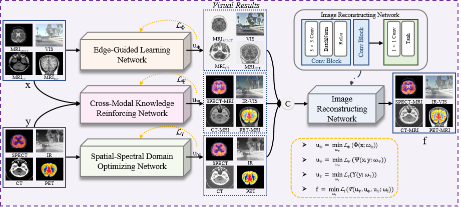
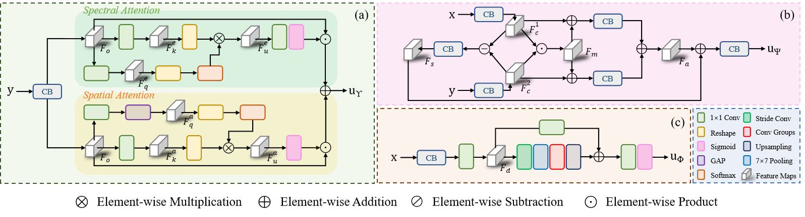
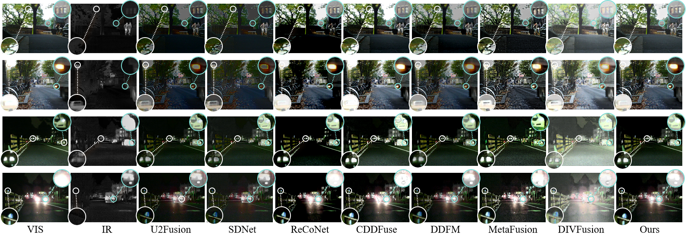
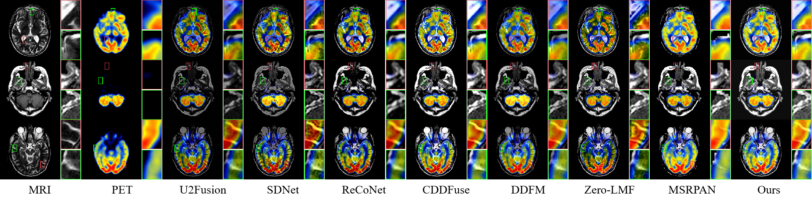

# MLFuse

This is the official code for the paper "MLFuse: Multi-scenario Feature Joint Learning for Multi-Modality Image Fusion".

## Abstract

Multi-modality image fusion (MMIF) entails synthesizing images with detailed textures and prominent objects. Existing methods tend to use general feature extraction to handle different fusion tasks. However, these methods have difficulty breaking fusion barriers across various modalities owing to the lack of targeted learning routes. In this work, we propose a multi-scenario feature joint learning architecture, MLFuse, that employs the commonalities of multi-modality images to deconstruct the fusion progress. Specifically, we construct a cross-modal knowledge reinforcing network that adopts a multipath calibration strategy to promote information communication between different images. In addition, two professional networks are developed to maintain the salient and textural information of fusion results. The spatial-spectral domain optimizing network can learn the vital relationship of the source image context with the help of spatial attention and spectral attention. The edge-guided learning network utilizes the convolution operations of various receptive fields to capture image texture information. The desired fusion results are obtained by aggregating the outputs from the three networks. Extensive experiments demonstrate the superiority of MLFuse for infrared-visible image fusion and medical image fusion. The excellent results of downstream tasks (\textit{i.e.}, object detection and semantic segmentation) further verify the high-quality fusion performance of our method.

## 🌐 Usage

### ⚙ Network Architecture

Our MLFuse is implemented in ``network.py``.

### 🏊 Training
**1. Virtual Environment**
```
# create virtual environment
conda create -n mlfuse python=3.8
conda activate mlfuse
# install mlfuse requirements
pip install -r requirements.txt
```
**2. Data Preparation**

* Download the RoadScene dataset from [this link](https://github.com/hanna-xu/RoadScene) and place it in the folder ``'./train_dataset/'``.

* Download the Medical dataset from [this link](http://www.med.harvard.edu/AANLIB/home.html) and place it in the folder ``'./train_dataset/'``.

**3. Pre-Processing for VSM**

[this link](https://github.com/JinleiMa/Image-fusion-with-VSM-and-WLS) is used to obtain visual saliency maps.

**4. MLFuse Training**

For a quick start, please run 
```shell
python train.py --root './train_dataset' --batch_size 16 --save_path './train_result' --summary_name 'MultiTask_qiuck_start_'
```
and the trained model is available in ``--save_path``.

### 🏄 Testing

**1. Pretrained models**

Pretrained models are available in ``'./model/model_fuse.pth'``.

**2. Test datasets**

The test datasets used in the paper have been stored in ``'./test_dataset/ir_vis_set_M3FD'``, ``'./test_dataset/ir_vis_set_M3FD'`` for IVIF, ``'./test_dataset/ct_mri_set'``, ``'./test_dataset/spect_mri_set'`` and ``'./test_dataset/pet_mri_set'`` for MIF.
It can be downloaded via [this link](https://github.com/Linfeng-Tang/MSRS), [this link](https://github.com/JinyuanLiu-CV/TarDAL) and [this link](http://www.med.harvard.edu/AANLIB/home.html). 

**3. MLFuse Testing**

* For a quick start, please run 
```shell
python test_gray.py --model_path './model/model_fuse.pth' --test_path './test_dataset/ct_mri_set' --result_path './test_result/test_ct'
```
* Managing RGB Input

  We refer to the [code of hanna-xu](https://github.com/hanna-xu/utils/tree/master/fusedY2RGB) to convert the fused image into a color image.
    The corresponding code file is 'YCbCr2RGB_Main_Double.m'

### 📃 Assessment

We refer to the [code](https://github.com/Linfeng-Tang/Image-Fusion/tree/main/General%20Evaluation%20Metric) to complete the evaluation work.

## 🙌 MLFuse

### Illustration of our MLFuse model.









### 📖 Citation
If you find our work useful in your research please consider citing our paper:
```
The corresponding information will be updated soon.
```

